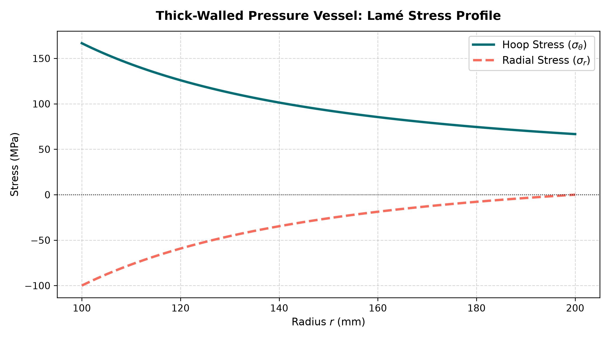

# Pressure Vessel Stress & Autofrettage Analysis

A Python module that calculates stresses, safety factor and yield status for internally pressurised cylindrical pressure vessels (thin-wall and thick-wall Lamé models), plus an autofrettage extension that estimates the residual stress benefit of plastic pre-expansion.

The project is deliberately built around **verification**: every result is backed by unit tests, published reference values, a hand-calculated MATLAB script, a genuine MATLAB-vs-Python cross-validation, and an LLM-reviewer benchmark. It was developed AI-first (see [How I used AI](#how-i-used-ai)), so the emphasis is on proving the code correct rather than assuming it.

---

## Contents

1. [What it does](#what-it-does)
2. [Quick start](#quick-start)
3. [Example output](#example-output)
4. [How it works](#how-it-works)
5. [Verification and validation](#verification-and-validation)
6. [Input limits and units](#input-limits-and-units)
7. [Assumptions and limitations](#assumptions-and-limitations)
8. [How I used AI](#how-i-used-ai)
9. [Repository structure](#repository-structure)
10. [Planned work](#planned-work)
11. [License](#license)

---

## What it does

Given internal pressure **P**, inner radius **r_i**, wall thickness **t** and material yield strength **σ_y**, the module:

- validates every input (type, finiteness, positivity, physical range) and rejects bad input instead of repairing it;
- selects a **thin-wall** model (r_i / t >= 10) or the **Lamé thick-wall** model (r_i / t < 10, with a `PressureVesselWarning`);
- computes hoop, longitudinal and radial stress, the **von Mises** equivalent stress, the **safety factor** and whether the vessel has **yielded**;
- optionally runs an **autofrettage** analysis: plastic radius, residual hoop stress at the bore, and the enhanced safety factor under working pressure.

## Quick start

Requires Python 3.10 or newer (developed on 3.14).

```bash
git clone <your-repo-url>
cd multidiscipline-engineering-autofrettage

python -m venv venv
venv\Scripts\activate            # Windows (PowerShell)
# source venv/bin/activate       # macOS / Linux

pip install -r requirements.txt
```

Run an analysis (pressure in MPa, lengths in mm):

```bash
python -m src.main --pressure 50 --radius 50 --thickness 20 --yield-strength 250
```

Add autofrettage and/or JSON output:

```bash
python -m src.main -P 50 -r 50 -t 20 -sy 250 --autofrettage-pressure 80
python -m src.main -P 50 -r 50 -t 20 -sy 250 --json
```

Run the test suite (44 tests):

```bash
pytest -v
```

Regenerate the stress-profile plot and CSV:

```bash
python python/analysis.py
```

## Example output

```text
==================================================
      PRESSURE VESSEL ANALYSIS SUMMARY
==================================================
  Model Selected     : lame_thick_wall
  Hoop Stress        : 154.167 MPa
  Longitudinal       : 52.083 MPa
  Radial Stress      : -50.0 MPa
  Von Mises Stress   : 176.814 MPa
  Safety Factor      : 1.414
  Yield Status       : SAFE (Elastic)
--------------------------------------------------
      AUTOFRETTAGE CAPSTONE SUMMARY
--------------------------------------------------
  Autofrettage Press : 80.0 MPa
  Plastic Radius r_p : 53.699 mm
  Residual Hoop Bore : -37.992 MPa
  Enhanced SF        : 1.722
==================================================
```

In this example the autofrettage step leaves a compressive residual hoop stress at the bore, raising the bore safety factor from 1.41 to 1.72.

Lamé stress profile for a thick-walled cylinder (r_i = 100 mm, r_o = 200 mm, P = 100 MPa). Radial stress runs from -100 MPa at the bore to 0 at the outer wall; hoop stress peaks at the bore:



## How it works

The code is layered with one-way dependencies:

```text
tests -> main -> analysis -> validation -> config
                    |
                    +-> physics -> config
```

| Layer | Path | Responsibility |
| :--- | :--- | :--- |
| Config | `src/config/limits.py` | Single source of truth for input limits, the thin/thick threshold and numerical tolerances |
| Validation | `src/validation/inputs.py` | Ordered checks: type, finiteness, positivity, range. Rejects `bool`, `NaN`, `inf`, strings and arrays |
| Physics | `src/physics/` | Pure functions: thin wall, Lamé thick wall, von Mises, safety factor, autofrettage |
| Orchestrator | `src/analysis.py` | Validates, selects the model, runs the physics, returns a frozen `VesselResult` |
| CLI | `src/main.py` | Argument parsing and formatted or JSON output |

Design decisions worth knowing:

- **Fail fast, never repair.** Invalid input raises an error. It is never clamped, coerced or defaulted.
- **`bool` is rejected explicitly** because Python treats `True` as the number 1.
- **Yielding is a result, not an error.** `yielded=True` is returned normally.
- **Autofrettage checks its applicability window first** (between initial-yield and full-yield pressure) before calling the numerical root-finder.

Full detail: [`docs/design.md`](docs/design.md), [`docs/requirements.md`](docs/requirements.md), [`docs/assumptions.md`](docs/assumptions.md).

## Verification and validation

| Layer of evidence | What it shows | Where |
| :--- | :--- | :--- |
| Unit and integration tests | 44 pytest tests: validation rules and ordering, physics, model selection at the r_i / t = 10 boundary, autofrettage, CLI | `tests/` |
| Reference test vectors | Thin-wall (TV-1), thick-wall (TV-2) and yielding (TV-3) cases matched within 1e-4 | `tests/conftest.py`, `tests/test_analysis.py` |
| Boundary conditions | Radial stress equals -P at the bore and 0 at the outer wall; hoop stress peaks at the bore | `tests/test_physics.py`, `python/analysis.py` (self-checks) |
| Hand-calculation script | MATLAB Lamé baseline with equilibrium, force-balance and hand-calc checks | `matlab/lame_stress_analysis.m` |
| MATLAB vs Python cross-validation | Independent engines agree; max relative error 1.7e-14 (tolerance 1e-5) | `src/validation/cross_validate.py`, [report](src/validation/matlab-python-comparison.md) |
| LLM reviewer benchmark | 10-case benchmark of a guardrailed review prompt; 10/10 after one prompt fix | [`evaluation/evaluation-report.md`](evaluation/evaluation-report.md) |

## Input limits and units

The module uses **millimetres for lengths and MPa for pressure and yield strength**. The MATLAB comparison and `python/lame_stress.py` use SI (m, Pa) and are documented as such.

| Input | Symbol | Allowed range | Unit |
| :--- | :--- | :--- | :--- |
| Pressure | P | > 0 to 100 | MPa |
| Inner radius | r_i | 1 to 5000 | mm |
| Wall thickness | t | 0.05 to 500 | mm |
| Yield strength | σ_y | 10 to 3000 | MPa |

Out-of-range values raise an error rather than being adjusted. This also catches unit slips such as entering pascals instead of MPa.

## Assumptions and limitations

Results are valid only within these assumptions (full register in [`docs/assumptions.md`](docs/assumptions.md)):

- isotropic, homogeneous, linear-elastic, ductile material (von Mises yield criterion);
- static internal pressure only, zero external pressure, closed ends, section far from end caps;
- no fatigue, thermal loads, welds, nozzles or corrosion allowance;
- thick-wall stresses evaluated at the inner surface, where they peak;
- autofrettage assumes an elastic-perfectly-plastic material, von Mises yielding and purely elastic unloading (no Bauschinger effect).

This is an educational and portfolio project. It is **not** a substitute for a certified design code or professional engineering review.

## How I used AI

I am learning Python, and this project was built **AI-first**: AI assistants (Claude and GitHub Copilot) generated most of the code, and I directed the engineering and verified the results. Because I could not rely on reading every line with a Python expert's eye, I built layers of evidence that do not depend on trusting the AI:

- a written requirements, design and assumptions set that the AI had to follow, including rules against changing physics formulas or relaxing limits;
- reference values and boundary conditions checked independently, by hand and in MATLAB;
- a test suite that pins down behaviour, including deliberately hostile inputs;
- a guardrailed reviewer prompt, benchmarked on good and defective cases.

The review process found real problems, which I fixed:

- a **sign error in the plotting script** that swapped the hoop and radial stress curves, caught by checking the boundary condition against the MATLAB baseline;
- a **cross-validation that was not independent**, because the "MATLAB" reference file had been generated in Python; it was replaced with data produced by real MATLAB;
- a **placeholder test that could never fail**, replaced with real assertions;
- leftover patch code (name-guessing imports, a duplicate function signature) removed in a cleanup pass.

The lesson I took from this: passing tests show the code does what the tests say, so the tests themselves and the reference data need scrutiny too.

## Repository structure

```text
multidiscipline-engineering-autofrettage/
├── src/                  # module: main.py, analysis.py, errors.py, config/, validation/, physics/
├── tests/                # pytest suite (44 tests)
├── python/               # standalone Lamé solver and plotting script
├── matlab/               # MATLAB hand-calc baseline and reference-data export
├── docs/                 # requirements, design, assumptions, checklists, prompt template
├── evaluation/           # LLM reviewer benchmark and report
├── prompts/              # prompt-engineering lab notes
├── agents/               # workspace audit scripts
├── output/               # generated CSV and plots
├── requirements.txt
├── pytest.ini
└── LICENSE
```

## Planned work

- Continuous integration (GitHub Actions running the test suite on every push)
- Agent evaluation: injecting known flaws into the code and measuring what the AI reviewer catches
- Wrapping the analysis as a small cloud API (Azure Functions)

## License

MIT. See [LICENSE](LICENSE).

**Author:** Finley Parker. [GitHub] https://github.com/SoraHana-Rem/multidiscipline-engineering-autofrettage-AI-Lab

 | [LinkedIn]https://www.linkedin.com/in/finley-parker-ba090b221/